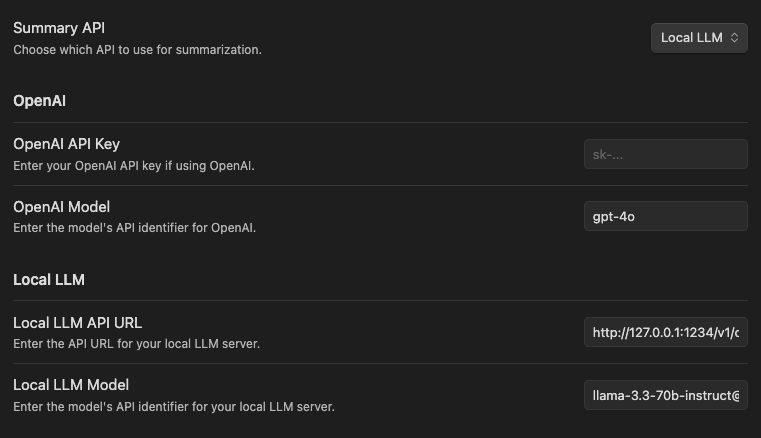

# Obsidian AI Helper

This is a simple AI Helper to Summarize selected text.  It supports both LocalLLM's and the OpenAI API.

## Installation Instructions

1. Install the Plugin in your `.obsidian/plugins` folder
2. Naviagate to `Settings` -> `Community plugins` -> `AI Helper`
3. Make sure the Plugin is Enabled and click the settings icon ⚙️
4. Select to use either your Local LLM or the Open AI API and fill in the corresponding settings

## Usage

1. Right click and "Summarize Selected Text"

2. Make any edits to the text and select one of:
  * Insert Inline: Insert the summary inline below the selected text.
  * Insert Summary: Add a summary to a section at the top of the document
  * Copy: Copy the summart to your clipboard

